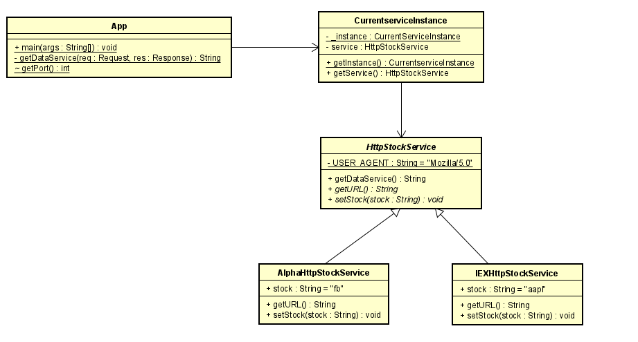

# Servicios Mercado de valores

### Daniel Santiago Ducuara Ardila
### 24/08/2021

## Resumen
Este repositorio consiste en la elaboración de una aplicación para consultar el mercado de valores de las acciones negociadas en la Bolsa.
La aplicación recibirá el identificador de una acción, por ejemplo “MSFT” para Microsoft  y deberá mostrar el histórico de la valoración intra-día, diaria, semanal y mensual. 

## Ejecución localmente 

## Ejecución en Heroku

## Diagrama de clases
 

